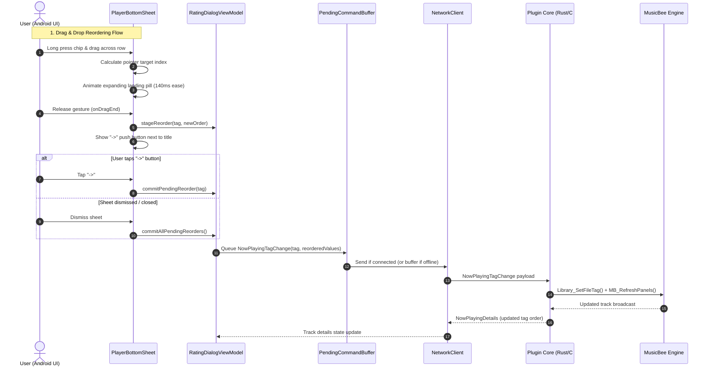

# Milestone Report: Features & Architectural Changes (v1.7.3)

---

## 1. Executive Summary

The **v1.7.3 release (Android)** and companion **v1.5.3 release (Windows Plugin)** build upon the custom metadata editing infrastructure introduced in v1.7.1 and v1.7.2. 

The primary objectives of this release cycle are:
1. **Interactive Chip Ergonomics**: Reordering multi-value metadata chips using touch gestures, introducing a non-disruptive landing gap animation, and adding explicit commit mechanics.
2. **Workflow Enhancements**: Tag clipboard copying and pasting with time-to-live (TTL) track tracking.
3. **Network & Offline Resilience**: Buffered and collapsible offline metadata edit queues with replay on reconnect.
4. **Architectural Hardening**: Eliminating main-thread database access exceptions in Jetpack Compose, resolving slot collision vulnerabilities in custom tag assignments, and establishing plural-tolerant field name resolution.

---

## 2. Feature Additions & UX Adjustments

### 2.1 Drag-and-Drop Chip Reordering
* **Long-Press Gesture Recognition**: Tapping and holding any multi-value chip initiates a drag interaction. The active chip is elevated (`zIndex(2f)`, `scale(1.08f)`) with visual shadow cues.
* **Expanding Gap Micro-Animation**:
  * Instead of instantly mutating the underlying collection mid-drag (which causes layout jumps and cursor de-sync in wrapping rows), an animated horizontal spacer (`animateDpAsState` with a 140ms `FastOutSlowInEasing` curve) expands at the target insertion slot between adjacent chips.
  * The actual list reordering is committed atomically when the gesture completes (`onDragEnd`).
* **Explicit Push Action & Deferred Commits**:
  * An explicit push icon button (`->`) appears next to the tag group title when pending reorders exist.
  * Tapping the push button immediately commits the new order to MusicBee as a semicolon-delimited string (`tag1; tag2; tag3`).
  * Dismissing or closing the player bottom sheet automatically commits any pending reordered tags.

### 2.2 Tag Field Copy & Paste (10-Track TTL)
* **Metadata Replication**: Users can copy all active chips from a tag category on the currently playing track and paste them onto subsequent tracks.
* **Bounded Lifetime (TTL)**: The in-memory tag clipboard tracks track-skip events and automatically purges copied values after 10 tracks to prevent accidental pasting of obsolete metadata.
* **Set Union Logic**: Pasting merges clipboard values into the target track's existing tags, deduplicating identical entries.

### 2.3 Tag Visual State & Confirmation
* **Confirmed Tag Tracking**: Chips now evaluate both the SQLite pre-synced library taxonomy and active track metadata values.
* **Immediate Feedback**: Newly added tags are marked as confirmed immediately upon creation, avoiding the state where entered chips remained grey until cache invalidation.

---

## 3. Architectural & Protocol Changes

### 3.1 Custom Tag Slot Isolation & Collision Prevention
* **Vulnerability in Previous Build**: When an unrecognized or unmapped custom tag was submitted, fallback logic in `TrackDetails.withTagValue()` defaulted the assignment to `custom1`, unintentionally overwriting the user's primary configured field (e.g. "Instruments").
* **Architecture Fix**:
  * Unmapped tags are now segregated in `dynamicTags: Map<String, String>` without touching explicit `custom1..custom16` slots.
  * In the Windows plugin (`TrackDataProvider.cs`), plural and singular alias normalization was added (`mood`/`moods`, `instrument`/`instruments`, `occasion`/`occasions`, `grouping`/`groupings`, `publisher`/`publishers`).

### 3.2 First-Class Mood Tag Pipeline
* **Rust Core**: Added `mood: String` (`#[serde(default, skip_serializing_if = "String::is_empty")]`) to `TrackDetails` in `mbrc-core/src/protocol/messages.rs`.
* **C# Plugin**: Added `Plugin.MetaDataType.Mood` to the metadata field query array in `TrackDataProvider.cs` and mapped it to the track details DTO.
* **Android Networking & State**: Added `mood` to `NowPlayingDetailsPayload.kt` and `TrackDetails.kt`, with plural-tolerant slot resolution (`clean.trimEnd('s') == name.trimEnd('s')`).

### 3.3 Concurrency & Database Thread Safety
* **Issue**: Direct synchronous calls to `CustomTagSuggestionDao` from UI state initializers caused `IllegalStateException: Cannot access database on the main thread` during fast sheet presentation on physical devices.
* **Mitigation**: Removed blocking DAO calls from UI pathways; autocomplete candidate lists are populated asynchronously through `_allTagValuesMap` on `Dispatchers.IO`, with synchronous fallbacks wrapped in defensive exception handlers.

### 3.4 Offline Command Queue & Reconnect Replay
* **Command Buffer Registration**: Added `Protocol.NowPlayingTagChange.context` to the replayable command set in `PendingCommandBuffer.kt`.
* **Per-Tag Collapse**: Configured `LAST_WRITE_WINS` semantics on a per-tag-key basis. Multiple successive edits to the same tag field collapse into the final intended value, while edits across different tags (e.g., `Genre` and `Mood`) are preserved and replayed in sequence upon reconnection.

### 3.5 LRU Suggestion Pruning & Storage Bounds
* Enforced a 50-item hard ceiling on `RecentTagsStoreImpl.kt`.
* Added `pruneStaleTags(activeTags)` to automatically purge stale entries when library taxonomies change.

---

## 4. Interaction & Data Flow

---

## 5. Known Issues & QA Observations

The following items are identified from device QA runs and remain open for refinement:

1. **Chip reorder animation jumpiness across multi-line wrap**:
   - In wrapping `FlowRow` layouts, dragging a chip between lines causes the target row to adjust its height dynamically, resulting in the chip jumping away from under the user's finger. Single-line reordering remains smooth with the expanding gap animation, but multi-line wrapping requires dedicated coordinate re-projection.
2. **Infrequent tag visibility desync from MusicBee**:
   - In rare instances, a value written to MusicBee does not immediately appear as a chip upon returning to the track (observed once during testing with a `Mood` tag). This is under observation for a possible race condition between disk file tag writing and the subsequent `MB_RefreshPanels` state notification broadcast.

---

## 6. Release & Versioning Commit Mapping

| Repo | Component | Scope | Description |
|---|---|---|---|
| **mbrc** | `feature:playback` | Feature | Expanding Gap chip reorder animation, `->` push button, and dismiss auto-commit |
| **mbrc** | `feature:playback` | Feature | Tag field Copy & Paste with 10-track TTL countdown listener |
| **mbrc** | `feature:playback` | Fix | Resolved Room UI thread crash when opening rating sheet |
| **mbrc** | `feature:playback` | Fix | Bounds clamping and debounce logic fixing `IndexOutOfBoundsException` during drag |
| **mbrc** | `feature:playback` | Fix | Immediate confirmed state propagation for active track tags |
| **mbrc** | `core:common` | Fix | Custom tag slot isolation in `dynamicTags` and plural-tolerant field name matching |
| **mbrc** | `core:networking` | Feature | Added `mood` field support in `NowPlayingDetailsPayload` |
| **mbrc** | `core:networking` | Feature | Offline command queueing and collapsing in `PendingCommandBuffer` |
| **mbrc-plugin** | `mbrc-core` | Protocol | Added `mood` property to `TrackDetails` struct in messages protocol |
| **mbrc-plugin** | `plugin` | Feature | Added `Mood` tag retrieval and commit handling in `TrackDataProvider.cs` |
| **mbrc-plugin** | `plugin` | Fix | Normalized plural and singular tag aliases (`moods`, `instruments`, etc.) |
